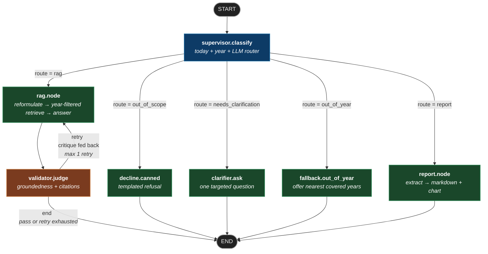

# LangGraph State Diagram

The compiled state machine that routes every chat message through the supervisor → worker → validator topology.

Source of truth: [poc/app/graph/builder.py](poc/app/graph/builder.py). Nodes live in [poc/app/graph/](poc/app/graph/) and [poc/app/agents/](poc/app/agents/). Edge functions are in [poc/app/graph/edges.py](poc/app/graph/edges.py).

---

## Topology



| Colour | Role |
|---|---|
| 🟦 Blue | Router — classifies the question and picks a branch |
| 🟩 Green | Worker — does the actual answering work |
| 🟧 Orange | Guard — checks the worker's output, may trigger a retry |
| ⬛ Dark grey | Terminal — graph entry / exit point |

---

## Nodes

| Node | File | LLM calls | What it returns |
|---|---|---|---|
| `supervisor.classify` | [graph/supervisor.py](poc/app/graph/supervisor.py) | 0–1 (skipped on year-gap short-circuit) | `{route, today, target_year?, covered_years, fallback_offered?, clarifier_reason?}`. Routes: `rag`, `report`, `out_of_scope`, `needs_clarification`, `out_of_year` |
| `decline.canned` | [graph/supervisor.py](poc/app/graph/supervisor.py) | 0 | `{final_answer, final_citations=[], validated=True}` |
| `clarifier.ask` | [graph/clarifier.py](poc/app/graph/clarifier.py) | 1 (with deterministic fallback) | `{final_answer (one clarifying question), final_citations=[]}` |
| `fallback.out_of_year` | [graph/supervisor.py](poc/app/graph/supervisor.py) | 0 | `{final_answer (names the nearest covered years), final_citations=[]}` |
| `rag.node` | [agents/rag_agent.py](poc/app/agents/rag_agent.py) | 2 (reformulate + answer) | `{reformulated_query, chunks (year-filtered when target_year set), draft_answer}` |
| `validator.judge` | [agents/validator_agent.py](poc/app/agents/validator_agent.py) | 1 | `{validation: {grounded, citations_ok, critique}, final_answer?, retry_count?}` |
| `report.node` | [agents/report_agent.py](poc/app/agents/report_agent.py) | 1 (JSON extractor) | `{final_answer (Markdown + base64 chart), final_citations}` |

---

## Conditional edges

| From | Edge function | Possible destinations |
|---|---|---|
| `supervisor` | [`route_from_supervisor`](poc/app/graph/edges.py) | `rag` &#124; `report` &#124; `out_of_scope` &#124; `needs_clarification` &#124; `out_of_year` → (`rag` &#124; `report` &#124; `decline` &#124; `clarifier` &#124; `fallback`) |
| `validator` | [`route_from_validator`](poc/app/graph/edges.py) | `retry` (→ `rag`) &#124; `end` |

`route_from_validator` returns `end` either when validation **passes** OR when `retry_count >= 1` (retry budget exhausted — answer is shown with an `⚠ Unverified` badge in the UI).

---

## Shared `GraphState`

Defined in [poc/app/graph/state.py](poc/app/graph/state.py) — a `TypedDict` whose keys accumulate across the run:

```text
Input            question, user_id, conversation_id, history, user_activity
Supervisor       route, today, target_year?, covered_years,
                 fallback_offered?, clarifier_reason?, audit_trace_id
RAG node         reformulated_query, chunks, draft_answer
Validator        validation, retry_count, last_critique
Terminal         final_answer, final_citations, validated
```

`history` and `user_activity` are pre-loaded by [api/routes/chat.py](poc/app/api/routes/chat.py) (Phase 4 memory) before the graph runs; rolling summarisation happens at load time via [memory/summarizer.py](poc/app/memory/summarizer.py).

---

## Streaming variant

The streaming endpoint (`POST /chat/stream`) doesn't invoke the compiled graph — it uses a manual walker in [poc/app/graph/streaming.py](poc/app/graph/streaming.py) that calls the same node functions, so it can yield NDJSON events around each node (token-level streaming inside RAG, stage events between nodes) while preserving exactly the same topology. The compiled graph is used by `POST /chat` (non-streaming).

---

## Regenerating this diagram

The hand-drawn Mermaid above is the canonical version (styled, captioned). LangGraph can also emit a raw Mermaid dump for audit:

```bash
cd poc && source .venv/bin/activate
python -c "from app.graph.builder import get_graph; \
  print(get_graph().get_graph().draw_mermaid())"
```

Diff the output against this file's diagram when changing the graph topology — any new node or edge from the auto-dump should be reflected here.
