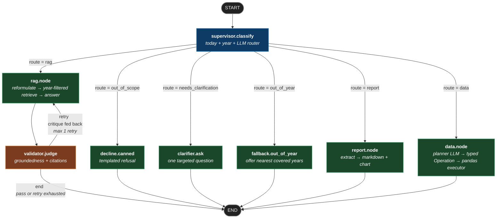
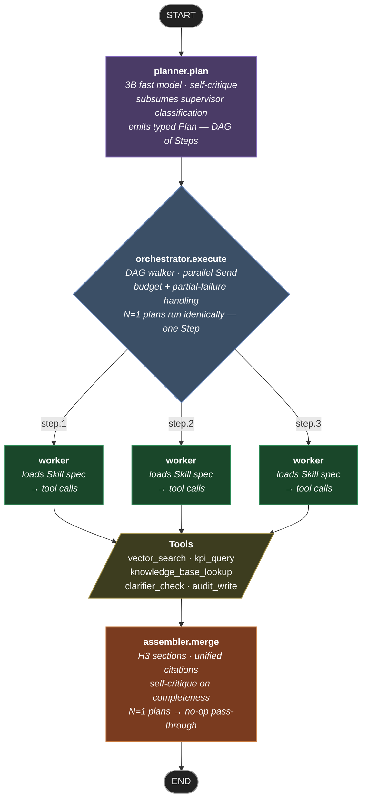

# LangGraph State Diagram

The compiled state machine that routes every chat message through the supervisor → worker → validator topology.

Source of truth: [poc/app/graph/builder.py](poc/app/graph/builder.py). Nodes live in [poc/app/graph/](poc/app/graph/) and [poc/app/agents/](poc/app/agents/). Edge functions are in [poc/app/graph/edges.py](poc/app/graph/edges.py).

**Why this shape?** See [docs/agent_topology.md](docs/agent_topology.md) — design rationale, per-node contracts (MUST / MUST NOT), the decision matrix that drives the supervisor, and the playbook for adding a new route in a future phase.

> 📋 **Phase 11 (planned)** introduces an agentic Planner · Orchestrator · Workers · Tools · Skills stack that supersedes the supervisor → single-worker shape below. See [§ Phase 11 — Agentic topology (planned)](#phase-11--agentic-topology-planned) and the full design in [docs/agentic.md](docs/agentic.md).

---

## Topology — Phase 1–10 (current)



| Colour | Role |
|---|---|
| 🟦 Blue | Router — classifies the question and picks a branch |
| 🟩 Green | Worker — does the actual answering work |
| 🟧 Orange | Guard — checks the worker's output, may trigger a retry |
| ⬛ Dark grey | Terminal — graph entry / exit point |

---

## Nodes

| Node | File | LLM calls | What it returns |
|---|---|---|---|
| `supervisor.classify` | [graph/supervisor.py](poc/app/graph/supervisor.py) | 0–1 (skipped on year-gap short-circuit) | `{route, today, target_year?, covered_years, fallback_offered?, clarifier_reason?}`. Routes: `rag`, `report`, `data`, `out_of_scope`, `needs_clarification`, `out_of_year` |
| `decline.canned` | [graph/supervisor.py](poc/app/graph/supervisor.py) | 0 | `{final_answer, final_citations=[], validated=True}` |
| `clarifier.ask` | [graph/clarifier.py](poc/app/graph/clarifier.py) | 1 (with deterministic fallback) | `{final_answer (one clarifying question), final_citations=[]}` |
| `fallback.out_of_year` | [graph/supervisor.py](poc/app/graph/supervisor.py) | 0 | `{final_answer (names the nearest covered years), final_citations=[]}` |
| `rag.node` | [agents/rag_agent.py](poc/app/agents/rag_agent.py) | 2 (reformulate + answer) | `{reformulated_query, chunks (year-filtered when target_year set), draft_answer}` |
| `validator.judge` | [agents/validator_agent.py](poc/app/agents/validator_agent.py) | 1 | `{validation: {grounded, citations_ok, critique}, final_answer?, retry_count?}` |
| `report.node` | [agents/report_agent.py](poc/app/agents/report_agent.py) | 1 (JSON extractor) when `target_year` is None · 3 (summary + narrative + recommendations narrators) when `target_year` is set (Phase 9 executive pipeline) | Without `target_year`: `{final_answer (Markdown + base64 chart), final_citations}`. With `target_year`: `{final_answer (executive Markdown), report_kind="executive", report_year, report_run_id}` — DOCX / PDF / MD downloadable via `GET /reports/{year}.{ext}` |
| `data.node` | [agents/data_agent.py](poc/app/agents/data_agent.py) | 1 (planner only — executor is pure pandas) | `{final_answer (narrative + Markdown table), data_operation (typed Operation JSON + drilldown/inherited/changed chips), last_data_operation}`. Refuses with typed reasons (`year_gap`, `invalid_aggregation`, `unknown_metric`, …) routed via the same node |

---

## Conditional edges

| From | Edge function | Possible destinations |
|---|---|---|
| `supervisor` | [`route_from_supervisor`](poc/app/graph/edges.py) | `rag` &#124; `report` &#124; `out_of_scope` &#124; `needs_clarification` &#124; `out_of_year` → (`rag` &#124; `report` &#124; `decline` &#124; `clarifier` &#124; `fallback`) |
| `validator` | [`route_from_validator`](poc/app/graph/edges.py) | `retry` (→ `rag`) &#124; `end` |

`route_from_validator` returns `end` either when validation **passes** OR when `retry_count >= 1` (retry budget exhausted — answer is shown with an `⚠ Unverified` badge in the UI).

---

## Shared `GraphState`

Defined in [poc/app/graph/state.py](poc/app/graph/state.py) — a `TypedDict` whose keys accumulate across the run:

```text
Input            question, user_id, conversation_id, history, user_activity
Supervisor       route, today, target_year?, covered_years,
                 fallback_offered?, clarifier_reason?, audit_trace_id
RAG node         reformulated_query, chunks, draft_answer
Validator        validation, retry_count, last_critique
Terminal         final_answer, final_citations, validated
```

`history` and `user_activity` are pre-loaded by [api/routes/chat.py](poc/app/api/routes/chat.py) (Phase 4 memory) before the graph runs; rolling summarisation happens at load time via [memory/summarizer.py](poc/app/memory/summarizer.py).

---

## Streaming variant

The streaming endpoint (`POST /chat/stream`) doesn't invoke the compiled graph — it uses a manual walker in [poc/app/graph/streaming.py](poc/app/graph/streaming.py) that calls the same node functions, so it can yield NDJSON events around each node (token-level streaming inside RAG, stage events between nodes) while preserving exactly the same topology. The compiled graph is used by `POST /chat` (non-streaming).

---

## Phase 11 — Agentic topology (planned)

Phase 11 replaces the supervisor → single-worker shape with a **Planner · Orchestrator · Workers · Tools · Skills** stack. The full capability catalogue lives in [docs/agentic.md](docs/agentic.md); this section is the graph-shape summary.



> **One pipeline, every turn.** Single-intent questions are just degenerate DAGs (Plan with one Step). The Orchestrator dispatches one Step exactly as it would three; the Assembler is a no-op pass-through. This buys consistent OTel spans, audit rows, and replay semantics across every turn at the cost of ~200 ms vs a bypass path. See [§ Future optimization: N=1 bypass](#future-optimization-n1-bypass) below if that latency ever matters.

| Colour | Role |
|---|---|
| 🟪 Purple | **Planner** — emits the typed `Plan` DAG |
| 🟦 Steel | **Orchestrator** — walks the DAG, fans out Steps in parallel |
| 🟦 Blue | **Supervisor (legacy)** — single-route fast path for N=1 plans |
| 🟩 Green | **Worker** — loads a Skill spec, calls its Tools |
| 🟨 Olive | **Tool** — atomic Pydantic-typed function (one OTel span + audit row per call) |
| 🟧 Orange | **Assembler / Validator** — guard nodes that critique outputs |
| ⬛ Dark grey | Terminal — graph entry / exit point |

### New nodes

| Node | File (planned) | LLM calls | What it returns |
|---|---|---|---|
| `planner.plan` | `poc/app/agents/planner_agent.py` | 1 (3B model) + 1 self-critique | `Plan{plan_id, steps: list[Step], rationale}` where `Step{step_id, skill_name, args, depends_on}` |
| `orchestrator.execute` | `poc/app/graph/orchestrator.py` | 0 (pure routing) | `{step_results: dict[step_id, StepResult], budget_remaining, partial: bool}` |
| `assembler.merge` | `poc/app/agents/assembler_agent.py` | 1 + 1 self-critique | `{final_answer, final_citations, missing_steps?}` |

### New persistent surfaces

- **Skill registry** — `poc/app/skills/__init__.py` exports all Skills, each Skill is `{name, description, system_prompt, tools, input_schema, output_schema}` (Pydantic-validated metadata). Planner sees `name + description + schemas` only.
- **Tool registry** — `poc/app/tools/__init__.py` exports atomic Pydantic-typed functions. Every Tool call emits an OTel span + audit row.
- **Audit events** — `plan.emitted`, `step.dispatched`, `step.completed`, `step.failed`, `tool.called`, `assembler.merged`, `feedback.received`. All keyed by `trace_id`; reviewers can replay any turn from the audit log alone.

### Future optimization: N=1 bypass

The flattened pipeline costs ~200 ms over Phase 1–10 for single-intent turns
(one Planner call on the 3B model + one Orchestrator round-trip + one no-op
Assembler call). If that latency ever becomes load-bearing — e.g. a real
production target of <1 s p95 — the staged path:

1. **Heuristic short-circuit inside the Planner.** If the question contains no
   multi-intent markers (`" AND "`, `";"`, `" & "`, more than one `?`), skip
   the Planner LLM call and synthesise a single-Step Plan from a regex-based
   route classifier. Cost: ~30 ms. Audit + OTel shape unchanged.
2. **Orchestrator fast-lane.** For Plans with `len(steps) == 1`, the
   Orchestrator can skip the `Send()` round-trip and call the worker inline.
   Cost: ~20 ms.
3. **Assembler no-op.** Already cheap; no further optimisation needed.

These are **opt-in** behind a `settings.agentic.fast_path = true` flag, so the
uniform pipeline stays the default. The audit + OTel shape is preserved
end-to-end — the Plan still gets emitted, the Step still gets dispatched —
so replay tools and Aspire queries continue to work without special-casing
single-intent turns. **Defer until measured latency demands it.**

### Failure modes + degradation

| Failure | Handling |
|---|---|
| Planner emits an invalid Plan (cycle, missing Skill) | Self-critique sub-call catches it before publishing; if it slips through, orchestrator rejects at runtime and routes to the legacy supervisor |
| One Step fails inside the DAG | Orchestrator records the failure, continues with independent Steps, surfaces a partial answer through the Assembler with a `⚠ partial` badge |
| Step needs clarification mid-flight | Worker invokes the `clarify_year` Skill — orchestrator pauses dependent Steps, returns the clarifying question via Assembler, resumes on next turn |
| Budget overrun (`max_steps`, `max_tool_calls`, `max_seconds`) | Orchestrator early-stops, Assembler emits whatever partial result is ready with a budget-exhausted note |

---

## Regenerating this diagram

The hand-drawn Mermaid above is the canonical version (styled, captioned). LangGraph can also emit a raw Mermaid dump for audit:

```bash
cd poc && source .venv/bin/activate
python -c "from app.graph.builder import get_graph; \
  print(get_graph().get_graph().draw_mermaid())"
```

Diff the output against this file's diagram when changing the graph topology — any new node or edge from the auto-dump should be reflected here.
