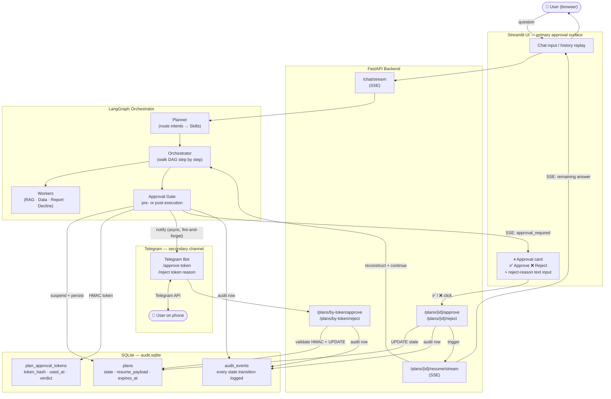
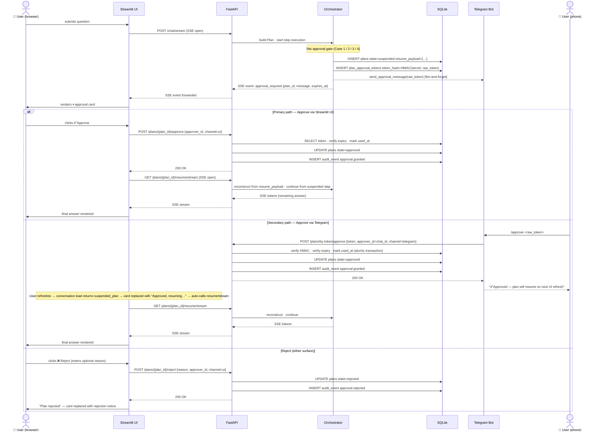

# Phase 12 — Human-in-the-Loop & Telegram channel

> **Implementation plan.** Design is locked before a single line of production code is written.
> Every contract, state machine, file path, and edge case is specified here.
> Deviating from this plan requires updating the plan first.

Branch: `poc/phase-12-hitl-telegram` → PR → `dev`

---

## 1 · Goals and non-goals

### Goals
- Four concrete approval triggers implemented (see §3)
- **Primary approval surface: Streamlit UI** — inline card with ✅ Approve / ❌ Reject buttons; no external tool required
- **Secondary approval surface: Telegram bot** — `/approve <token>` / `/reject <token> <reason>` for approvals from a phone while away from the desk
- Both surfaces are available simultaneously; first verdict wins (one-shot token)
- Tokens are short-lived (15 min), HMAC-signed, and one-shot
- Every state transition is one audit row; the full approval trail is in `audit.sqlite`
- Adding Slack or Teams later is a **one-file PR** (new `ApprovalChannel` implementation)

### Non-goals (Phase 12)
- Multiple approval gates per plan (one gate per plan in Phase 12)
- Approval chains (multiple approvers required before resuming)
- Push notifications (Apple/Google services)
- SMS / WhatsApp
- Persistent plans across sessions (Phase 14)

---

## 2 · Architecture overview

```
User submits question
        │
        ▼
  Planner builds Plan
        │
        ▼
  Orchestrator walks DAG
        │
        ├─ regular Step ──────────────────────────► execute → continue
        │
        └─ approval-gated Step
                │
                ├─ 1. save Plan state to plans table (state=suspended)
                ├─ 2. generate HMAC token → save token_hash to approval_tokens table
                ├─ 3. emit approval_required SSE event + audit row
                ├─ 4. send Telegram message (if channel=telegram)
                └─ 5. return partial answer to UI with "awaiting approval" block
                                    │
                                    ▼ (separate HTTP request, later)
                         POST /plans/{plan_id}/approve  or  /reject
                                    │
                                    ├─ validate token (HMAC, expiry, one-shot)
                                    ├─ update plans.state = approved / rejected
                                    ├─ emit approval.granted / approval.rejected audit row
                                    └─ approved ──► GET /plans/{plan_id}/resume/stream
                                                           │
                                                           ▼
                                                  reconstruct orchestrator
                                                  from resume_payload JSON,
                                                  continue from suspended step,
                                                  stream remaining tokens to UI
```

**Key design constraint:** The orchestrator runs synchronously within an HTTP streaming request. Resumption is a **new** HTTP request that reconstructs the orchestrator from the persisted JSON blob — no background threads, no long-running processes, no async state in memory.

---

### 2.1 · High-level component diagram



---

### 2.2 · Approval flow sequence diagram



---

## 3 · The four approval triggers

Two gate types:
- **Pre-execution gate** — Orchestrator suspends **before** running the step (static Skill flag `requires_approval=True`)
- **Post-execution gate** — Orchestrator runs the step, inspects the result, suspends **before delivering** it to the user (dynamic runtime condition)

---

### Case 1 — Executive report delivery (pre-execution gate)

**Trigger:** Planner routes to `executive-section-summary` or `generate-report-draft` skill.

**Why:** A compliance officer must review the generated report before it reaches leadership. The report should never be auto-delivered.

**Implementation:** Set `requires_approval=True` on `executive_section_summary` and `generate_report_draft` Skills. Orchestrator suspends before invoking the Report worker.

**Approval message shown to reviewer:**
> "A draft report section for year {year} has been generated. Review the content below before approving delivery to the user."

**Resume behaviour:** On approval, Orchestrator continues with the Report worker → Assembler delivers the report with download buttons as normal.

---

### Case 2 — Unverified RAG answer (post-execution gate)

**Trigger:** After the RAG worker finishes, `validated=False` (Validator returned `grounded=False` after the one retry).

**Why:** In Phase 11 the system shows an `⚠ Unverified` badge and delivers anyway. For Phase 12, a senior agent must approve before any unverified answer reaches a customer.

**Implementation:** In the Orchestrator, after a RAG step result arrives:

```python
if step_result.get("validated") is False:
    _suspend_post_execution(step, plan, state, step_result)
    return _make_suspended_result(step.step_id, approval_message="Validator flagged this answer as potentially ungrounded. Review before approving delivery.")
```

The `step_result` (the unverified answer + citations) is saved inside `resume_payload.completed_step_result`. On approval, the Orchestrator skips re-execution and passes the saved result directly to the Assembler.

---

### Case 3 — Large financial KPI figure (post-execution gate)

**Trigger:** After a `compute-kpi` step, any numeric figure in the result exceeds `settings.approvals_kpi_threshold` (default: `100_000`, configurable in `.env` as `APPROVALS_KPI_THRESHOLD`).

**Why:** A junior branch operator should not autonomously confirm large claim amounts or premium figures to a customer without manager sign-off.

**Implementation:** In the Orchestrator, after a Data step result arrives:

```python
if _has_large_figure(step_result, settings.approvals_kpi_threshold):
    _suspend_post_execution(step, plan, state, step_result)
    return _make_suspended_result(step.step_id, approval_message=f"KPI answer contains figures above €{settings.approvals_kpi_threshold:,}. Manager approval required before delivery.")
```

`_has_large_figure(result, threshold)` scans the `narrative` and `table` fields of the KPI result for numeric values > threshold using a regex extract — no LLM call, < 1 ms.

Add to `.env.example`:
```bash
APPROVALS_KPI_THRESHOLD=100000   # suspend KPI answers with figures above this value
```

---

### Case 4 — Bulk document ingestion (pre-execution gate)

**Trigger:** Planner routes to a future `bulk-ingest` Skill (not yet implemented — Phase 12 creates the Skill stub).

**Why:** New policy PDFs must be reviewed by legal before they enter the knowledge base. Auto-ingestion risks outdated or incorrect documents being served to customers.

**Implementation:** Set `requires_approval=True` on the `bulk-ingest` Skill. The Orchestrator suspends before the Ingestion worker runs. The reviewer sees the document metadata + first 3 chunk previews in the approval card.

**Note:** The full `bulk-ingest` Skill implementation is Phase 12 scope only as a **stub** — the Skill exists, the approval gate works, the actual ingestion pipeline wiring is Phase 13 work. This keeps Phase 12 focused.

---

### Summary table

| Case | Gate type | Checked by | Condition | Resume skips re-execution? |
|---|---|---|---|---|
| 1 — Executive report | Pre-execution | Skill flag | `requires_approval=True` | N/A (step not yet run) |
| 2 — Unverified answer | Post-execution | Orchestrator | `validated=False` after retry | **Yes** — saved result delivered |
| 3 — Large KPI figure | Post-execution | Orchestrator | any figure > threshold | **Yes** — saved result delivered |
| 4 — Bulk ingestion | Pre-execution | Skill flag | `requires_approval=True` on `bulk-ingest` | N/A (step not yet run) |

---

## 4 · Database schema

Two new tables in `poc/data/audit.sqlite` (same file as existing audit + memory).

```sql
-- poc/app/approvals/schema.sql

CREATE TABLE IF NOT EXISTS plans (
    id              TEXT    PRIMARY KEY,   -- uuid4, same as plan_id from Planner
    user_id         TEXT    NOT NULL,
    conversation_id INTEGER,
    state           TEXT    NOT NULL DEFAULT 'pending',
    -- state ∈ {pending, executing, suspended, approved, rejected, expired, done, failed}
    pending_step_id TEXT,                  -- step that is gated (null when not suspended)
    resume_payload  TEXT,                  -- JSON blob: graph state for reconstruction
    created_at      TEXT    NOT NULL,
    updated_at      TEXT    NOT NULL,
    expires_at      TEXT    NOT NULL       -- ISO-8601; NULL = never (set to +15min on suspension)
);

CREATE TABLE IF NOT EXISTS plan_approval_tokens (
    token_hash  TEXT    PRIMARY KEY,       -- HMAC-SHA256 hex of the raw token
    plan_id     TEXT    NOT NULL,
    step_id     TEXT    NOT NULL,
    issued_at   TEXT    NOT NULL,
    expires_at  TEXT    NOT NULL,          -- issued_at + 15min
    used_at     TEXT,                      -- NULL = not yet used (one-shot enforcement)
    verdict     TEXT,                      -- 'approved' | 'rejected' | NULL
    approver_id TEXT,                      -- user_id or telegram chat_id string
    channel     TEXT,                      -- 'ui' | 'telegram'
    FOREIGN KEY (plan_id) REFERENCES plans(id)
);
```

**Important:** Both tables are created by `approvals/store.py` at startup, lazily (same pattern as `audit/store.py`). Never create them in migrations or in `__init__.py`.

---

## 5 · New audit event types

Add to `poc/app/audit/events.py`:

```python
PLAN_STATE_CHANGE    = "plan.state_change"    # {plan_id, old_state, new_state}
APPROVAL_REQUESTED   = "approval.requested"   # {plan_id, step_id, skill_name, channel, token_exp}
APPROVAL_GRANTED     = "approval.granted"     # {plan_id, step_id, approver_id, channel}
APPROVAL_REJECTED    = "approval.rejected"    # {plan_id, step_id, approver_id, channel, reason}
```

---

## 5 · Skill metadata change

Add one optional field to the `Skill` dataclass in `poc/app/skills/__init__.py`:

```python
class Skill(BaseModel):
    # ... existing fields unchanged ...
    requires_approval: bool = False
    approval_message: str = ""   # shown in the UI card + Telegram message
```

All existing Skills default to `requires_approval=False` — **zero behaviour change for Phase 11 skills**.

For Phase 12, create one demo skill that requires approval:

```python
# poc/app/skills/generate_report_draft.py
skill = Skill(
    name="generate-report-draft",
    description="Generate a draft executive report section that requires compliance approval before delivery.",
    owner_worker="report",
    model="qwen2.5:7b",
    system_prompt=load_prompt("skills/generate_report_draft"),
    input_fields={"target_year": "int", "section": "str"},
    requires_approval=True,
    approval_message="A draft report section has been generated. Review and approve before sending to the user.",
)
```

---

## 6 · Token system

**File:** `poc/app/approvals/tokens.py`

```python
# Contract:
#   generate_token(plan_id, step_id) -> (raw_token: str, token_hash: str, expires_at: datetime)
#   validate_token(raw_token, db) -> ApprovalToken | raises TokenError
```

Rules:
- Raw token: `secrets.token_urlsafe(24)` — 192-bit entropy, URL-safe, no padding issues in Telegram commands
- Hash: `hmac.new(settings.approval_hmac_secret.encode(), raw_token.encode(), hashlib.sha256).hexdigest()`
- Expiry: `datetime.now(UTC) + timedelta(minutes=15)`
- **Never log the raw token.** Log only the hash.
- **One-shot:** on first use, set `used_at = now()` in the same transaction that updates `plans.state`
- `TokenError` subclasses: `TokenExpiredError`, `TokenAlreadyUsedError`, `TokenNotFoundError`

`settings.approval_hmac_secret` is a required env var (`APPROVAL_HMAC_SECRET` in `.env`). If missing at startup the API raises `RuntimeError` — never silently default to an empty string.

---

## 7 · `ApprovalChannel` interface

**File:** `poc/app/approvals/channels/base.py`

```python
from abc import ABC, abstractmethod

class ApprovalChannel(ABC):
    @abstractmethod
    def send_approval_request(
        self,
        plan_id: str,
        step_id: str,
        skill_name: str,
        approval_message: str,
        raw_token: str,
        expires_at: str,
    ) -> None:
        """Send the approval request to the channel. Must not raise on send failure — log and continue."""

    @abstractmethod
    def send_verdict_confirmation(
        self, plan_id: str, verdict: str, approver_id: str
    ) -> None:
        """Notify the channel that a verdict was recorded."""
```

**Implementations:**

| Class | File | Behaviour |
|---|---|---|
| `UiOnlyChannel` | `channels/ui_only.py` | No-op — UI card is shown via SSE; no external message sent |
| `TelegramChannel` | `channels/telegram.py` | Sends a formatted message to `settings.telegram.chat_id` via `python-telegram-bot` (sync `Bot.send_message`) |

Channel selected at startup in `poc/app/approvals/__init__.py`:

```python
def get_approval_channel() -> ApprovalChannel:
    if settings.approvals_channel == "telegram":
        return TelegramChannel(settings.telegram_bot_token, settings.telegram_chat_id)
    return UiOnlyChannel()
```

---

## 8 · Orchestrator changes

**File:** `poc/app/graph/orchestrator.py`

Current orchestrator walks the plan DAG and executes each step synchronously. Phase 12 adds a suspension point.

### When dispatching a step:

```python
# Before invoking the worker:
skill = get_skill_registry()[step.skill_name]
if skill.requires_approval:
    _suspend_for_approval(step, plan, state, graph_state_snapshot)
    return _make_suspended_result(step.step_id, skill.approval_message)
```

### `_suspend_for_approval` logic (exact steps, in order):

1. Serialize `graph_state_snapshot` to JSON (must be JSON-serializable — verify at plan creation, not at suspension)
2. `plan_store.save(plan_id, state="suspended", pending_step_id=step.step_id, resume_payload=snapshot_json)`
3. `raw_token, token_hash, expires_at = generate_token(plan_id, step.step_id)`
4. `token_store.save(token_hash, plan_id, step.step_id, expires_at)`
5. `channel.send_approval_request(plan_id, step.step_id, skill.name, skill.approval_message, raw_token, expires_at)`
6. `audit_record(state, APPROVAL_REQUESTED, {plan_id, step_id, skill_name, channel, token_exp})`
7. Return — do NOT raise an exception, do NOT call `st.rerun()`

### `resume_payload` schema (JSON blob stored in `plans.resume_payload`):

```json
{
  "plan": { "plan_id": "...", "steps": [...] },
  "completed_steps": {
    "step-1": { "output": "...", "citations": [...] }
  },
  "question": "...",
  "conversation_id": 42,
  "history": [...],
  "today": "2026-07-02"
}
```

**Constraint:** `completed_steps` values must be JSON-serializable. Any non-serializable type (e.g. pandas DataFrame) must be converted to dict/list before saving. This is enforced by a `pydantic.BaseModel` wrapper, not by hand-rolled `json.dumps`.

---

## 9 · Streaming protocol — new SSE event types

**File:** `poc/app/graph/streaming.py`

Add two new event types:

```python
# Emitted when the orchestrator suspends a step
{"type": "approval_required", "plan_id": "...", "step_id": "...", "message": "...", "expires_at": "..."}

# Emitted when the orchestrator resumes (first event on the resume stream)
{"type": "plan_resumed", "plan_id": "...", "step_id": "..."}
```

The UI consumes `approval_required` to:
1. Stop the "thinking" indicator
2. Render the approval card (see §11)
3. Store `plan_id` in `st.session_state.pending_approval`

---

## 10 · New API endpoints

**File:** `poc/app/api/routes/plans.py`

```
POST /plans/{plan_id}/approve     body: ApproveRequest {token: str}
POST /plans/{plan_id}/reject      body: RejectRequest  {token: str, reason: str = ""}
GET  /plans/{plan_id}             → PlanStatus {plan_id, state, pending_step_id, ...}
GET  /plans/{plan_id}/resume/stream  → SSE stream (continuation of the suspended turn)
GET  /plans                       query: user_id → list[PlanStatus]
```

### `POST /plans/{plan_id}/approve` logic (exact steps):

1. Load token record by hash (`hmac(request.token)`)
2. Check `token.plan_id == plan_id` — raise 400 if not
3. Check `token.expires_at > now()` — raise 410 (Gone) if expired
4. Check `token.used_at is None` — raise 409 (Conflict) if already used
5. In a single SQLite transaction:
   a. `token.used_at = now(); token.verdict = "approved"; token.approver_id = user_id`
   b. `plan.state = "approved"; plan.updated_at = now()`
6. `audit_record(APPROVAL_GRANTED, {plan_id, step_id, approver_id, channel="ui"})`
7. `channel.send_verdict_confirmation(plan_id, "approved", approver_id)`
8. Return `ApproveResponse {ok: True, plan_id, resume_url: f"/plans/{plan_id}/resume/stream"}`

**Error responses must never include raw stack traces.** Use `HTTPException` with a human-readable `detail`.

### `GET /plans/{plan_id}/resume/stream` logic:

1. Load plan from DB — check `state == "approved"`, else 409
2. Deserialize `resume_payload`
3. Reconstruct orchestrator graph state from payload
4. Set `plan.state = "executing"` in DB
5. Continue the orchestrator walk from `pending_step_id`
6. Stream remaining tokens via SSE (same format as `/chat/stream`)
7. On completion: `plan.state = "done"`
8. On error: `plan.state = "failed"`; emit error SSE event; never expose internal details

---

## 11 · Streamlit UI — primary approval surface

**File:** `poc/app/ui/streamlit_app.py`

The Streamlit UI is the **primary** approval path. No external tool required — the user sees the card, clicks Approve or Reject, and the stream continues in the same browser tab.

---

### 11.1 New session state keys

Add to the initialization block at the very top of the script (alongside `rated_turns`):

```python
if "pending_approval" not in st.session_state:
    st.session_state.pending_approval = None
    # None | {plan_id, step_id, message, expires_at, trigger_case}

if "resuming_plan_id" not in st.session_state:
    st.session_state.resuming_plan_id = None

if "rejection_reason" not in st.session_state:
    st.session_state.rejection_reason = ""
```

Clear both in `_switch_conversation()` and `_start_new_conversation()` — same pattern as `rated_turns`.

---

### 11.2 Capturing the approval event from the SSE stream

Inside `token_stream()`, add alongside the existing event handlers:

```python
elif etype == "approval_required":
    st.session_state.pending_approval = {
        "plan_id":     event["plan_id"],
        "step_id":     event["step_id"],
        "message":     event.get("message", "Approval required before continuing."),
        "expires_at":  event["expires_at"],
        "trigger_case": event.get("trigger_case", ""),  # "report"|"unverified"|"kpi"|"ingest"
    }
    # Do NOT call st.rerun() here — the card will render after the stream ends
```

---

### 11.3 Approval card — exact rendering

The card is rendered in **two places** so it survives all reruns:

1. **After the streaming block** — immediately after `st.write_stream()` finishes, inside the `with st.chat_message("assistant"):` context
2. **In the history replay loop** — for every assistant entry where the conversation has a pending approval on that `plan_id`

```
┌─────────────────────────────────────────────────────────────┐
│  ⏸  Waiting for your approval                              │
│                                                             │
│  <approval_message>                                         │
│                                                             │
│  ⏰ Expires: <expires_at>  (also show "X min remaining")    │
│                                                             │
│  [    ✅ Approve    ]   [    ❌ Reject    ]                  │
│                                                             │
│  Reason (optional — shown only when Reject is clicked):     │
│  [ text input field                                       ] │
└─────────────────────────────────────────────────────────────┘
```

The "Reason" text input only appears after the user clicks Reject once — not before.

---

### 11.4 Button click flows (no infinite rerun)

**Approve:**

```python
col_approve, col_reject, _ = st.columns([2, 2, 6])

with col_approve:
    if st.button("✅ Approve", key=f"approval_approve_{plan_id}"):
        try:
            approve_plan(plan_id)   # POST /plans/{plan_id}/approve (no token — UI session is trusted)
            st.session_state.pending_approval = None
            st.session_state.resuming_plan_id = plan_id
            st.toast("Approved — resuming…", icon="✅")
        except Exception as exc:
            st.toast(f"Could not approve: {exc}", icon="⚠️")
        st.rerun()   # only inside button handler — Phase 11 rule
```

**Reject — two-step (click once to reveal reason field, click again to confirm):**

```python
with col_reject:
    if st.button("❌ Reject", key=f"approval_reject_{plan_id}"):
        st.session_state.rejection_reason = "__pending__"   # flag to show the reason input
        st.rerun()

if st.session_state.rejection_reason == "__pending__":
    reason = st.text_input("Rejection reason (optional):", key=f"rejection_reason_{plan_id}")
    if st.button("Confirm rejection", key=f"approval_reject_confirm_{plan_id}"):
        try:
            reject_plan(plan_id, reason=reason)
            st.session_state.pending_approval = None
            st.session_state.rejection_reason = ""
            st.toast("Plan rejected.", icon="❌")
        except Exception as exc:
            st.toast(f"Could not reject: {exc}", icon="⚠️")
        st.rerun()
```

---

### 11.5 Resumption stream

When `st.session_state.resuming_plan_id` is set at the top of the main script loop, call `stream_plan_resume()` instead of `stream_chat()`:

```python
if st.session_state.resuming_plan_id:
    plan_id = st.session_state.resuming_plan_id
    st.session_state.resuming_plan_id = None   # clear before streaming to avoid re-entry
    with st.chat_message("assistant", avatar=ASSISTANT_AVATAR):
        # identical streaming block to the normal chat — reuses token_stream logic
        answer = st.write_stream(stream_plan_resume(plan_id))
        st.session_state.history[-1]["content"] += f"\n\n{answer}"  # append to existing partial
```

`stream_plan_resume(plan_id)` in `api_client.py` calls `GET /plans/{plan_id}/resume/stream` — same SSE format as `/chat/stream`.

---

### 11.6 Page-refresh recovery

When the user refreshes the browser mid-approval, `st.session_state` is wiped. On conversation load (`get_messages(conversation_id)`), the API must also return any **suspended plan** for that conversation. Add to the `ConversationMessages` response:

```python
class ConversationMessages(BaseModel):
    messages: list[Message]
    suspended_plan: SuspendedPlanInfo | None = None  # None if no pending approval
```

On load, if `suspended_plan` is not None, set `st.session_state.pending_approval` from the returned data. This way the approval card reappears after a refresh.

---

### 11.7 What the card looks like per trigger case

| Trigger case | `message` shown to user | Approve action |
|---|---|---|
| Executive report | "A draft report section has been generated. Review and approve before delivery." | Delivers report to user |
| Unverified answer | "Validator flagged this answer as potentially ungrounded. Review before approving." | Delivers answer with `⚠ Unverified` badge still visible |
| Large KPI figure | "This answer contains figures above €{threshold:,}. Manager approval required." | Delivers KPI answer normally |
| Bulk ingestion | "New documents are ready to ingest. Legal review required before adding to the knowledge base." | Triggers ingestion pipeline |

---

### 11.8 Phase 11 rules that apply here

- `st.rerun()` only inside button handlers — never at the end of a streaming block
- Approval state lives in `st.session_state` (not re-derived from the response on every rerun)
- Card is rendered in history replay so it survives all reruns, not just the live block
- Button keys include `plan_id` so they're unique per approval request (`key=f"approval_approve_{plan_id}"`)

---

## 12 · Telegram integration — full step-by-step

---

### 12.1 One-time Telegram setup (document in SETUP.md)

**Step 1 — Create the bot**

1. Open Telegram, search for `@BotFather`
2. Send `/newbot` → follow prompts → receive `BOT_TOKEN` (format: `123456:ABC-DEF…`)
3. Send `/setcommands` to BotFather → paste:
   ```
   approve - Approve a pending plan: /approve <token>
   reject - Reject a pending plan: /reject <token> [reason]
   ```

**Step 2 — Get your chat ID**

1. Send any message to your new bot
2. Open `https://api.telegram.org/bot<BOT_TOKEN>/getUpdates` in browser
3. Find `"chat": {"id": <number>}` — that number is `TELEGRAM_CHAT_ID`

**Step 3 — Add to `.env`**

```bash
APPROVALS_CHANNEL=telegram
APPROVAL_HMAC_SECRET=<output of: python3 -c "import secrets; print(secrets.token_hex(32))">
TELEGRAM_BOT_TOKEN=<BOT_TOKEN from BotFather>
TELEGRAM_CHAT_ID=<chat id number>
```

**Step 4 — Install the library**

`python-telegram-bot>=21.0` is already in `requirements.txt` for Phase 12. Activate venv and run `pip install -r requirements.txt`.

---

### 12.2 How the bot sends approval requests

When the Orchestrator suspends a step, `TelegramChannel.send_approval_request()` is called. It sends a formatted message to `TELEGRAM_CHAT_ID`:

```
⏸ Approval required

Plan: <plan_id>
Step: <step_id> (<skill_name>)

<approval_message>

To approve:
/approve <raw_token>

To reject:
/reject <raw_token> optional reason here

⏰ Expires: <expires_at UTC>
```

**Implementation (sync — no `asyncio` in the FastAPI request path):**

```python
# poc/app/approvals/channels/telegram.py
import httpx

class TelegramChannel(ApprovalChannel):
    def __init__(self, bot_token: str, chat_id: str) -> None:
        self._api_url = f"https://api.telegram.org/bot{bot_token}/sendMessage"
        self._chat_id = chat_id

    def send_approval_request(self, plan_id, step_id, skill_name,
                               approval_message, raw_token, expires_at):
        text = (
            f"⏸ *Approval required*\n\n"
            f"Plan: `{plan_id}`\n"
            f"Step: `{step_id}` ({skill_name})\n\n"
            f"{approval_message}\n\n"
            f"To approve:\n`/approve {raw_token}`\n\n"
            f"To reject:\n`/reject {raw_token} optional reason`\n\n"
            f"⏰ Expires: {expires_at}"
        )
        try:
            httpx.post(
                self._api_url,
                json={"chat_id": self._chat_id, "text": text, "parse_mode": "Markdown"},
                timeout=5.0,
            ).raise_for_status()
        except Exception:
            log.warning("Telegram send_approval_request failed — continuing without notification")
            # Never raise here: a Telegram send failure must NOT block the orchestrator

    def send_verdict_confirmation(self, plan_id, verdict, approver_id):
        icon = "✅" if verdict == "approved" else "❌"
        text = f"{icon} Plan `{plan_id}` {verdict} by {approver_id}"
        try:
            httpx.post(
                self._api_url,
                json={"chat_id": self._chat_id, "text": text, "parse_mode": "Markdown"},
                timeout=5.0,
            )
        except Exception:
            log.warning("Telegram send_verdict_confirmation failed — ignored")
```

**Rule:** `send_approval_request` must never raise. A Telegram outage must not crash the orchestrator.

---

### 12.3 The bot process — `telegram_bot.py`

**File:** `poc/app/approvals/telegram_bot.py`

This is a standalone script that runs in its own terminal. It polls Telegram for commands and calls the FastAPI approval endpoints.

```python
# poc/app/approvals/telegram_bot.py
"""Standalone Telegram bot for plan approval/rejection.

Run with:  python -m app.approvals.telegram_bot
Requires:  TELEGRAM_BOT_TOKEN, TELEGRAM_CHAT_ID, API_BASE_URL in env / .env
"""
from __future__ import annotations

import httpx
from telegram import Update
from telegram.ext import Application, CommandHandler, ContextTypes

from app.config import settings
from app.observability.logging import get_logger

log = get_logger(__name__)
API = settings.ui_api_url   # same env var the UI uses — http://localhost:8000


async def approve_handler(update: Update, context: ContextTypes.DEFAULT_TYPE) -> None:
    """Handle /approve <token>"""
    chat_id = str(update.effective_chat.id)
    args = context.args or []
    if not args:
        await update.message.reply_text("Usage: /approve <token>")
        return
    raw_token = args[0]

    try:
        r = httpx.post(
            f"{API}/plans/by-token/approve",
            json={"token": raw_token, "approver_id": chat_id, "channel": "telegram"},
            timeout=10.0,
        )
        if r.status_code == 200:
            await update.message.reply_text("✅ Approved. The assistant will continue.")
        elif r.status_code == 410:
            await update.message.reply_text("⏰ Token expired. Ask the user to retry.")
        elif r.status_code == 409:
            await update.message.reply_text("ℹ️ Already processed.")
        else:
            await update.message.reply_text(f"⚠️ Error {r.status_code}: {r.text[:200]}")
    except Exception as exc:
        log.exception("approve_handler error")
        await update.message.reply_text(f"⚠️ Could not reach the API: {exc}")


async def reject_handler(update: Update, context: ContextTypes.DEFAULT_TYPE) -> None:
    """Handle /reject <token> [reason]"""
    chat_id = str(update.effective_chat.id)
    args = context.args or []
    if not args:
        await update.message.reply_text("Usage: /reject <token> [optional reason]")
        return
    raw_token = args[0]
    reason = " ".join(args[1:]) if len(args) > 1 else ""

    try:
        r = httpx.post(
            f"{API}/plans/by-token/reject",
            json={"token": raw_token, "reason": reason, "approver_id": chat_id, "channel": "telegram"},
            timeout=10.0,
        )
        if r.status_code == 200:
            await update.message.reply_text("❌ Rejected.")
        elif r.status_code == 410:
            await update.message.reply_text("⏰ Token expired.")
        elif r.status_code == 409:
            await update.message.reply_text("ℹ️ Already processed.")
        else:
            await update.message.reply_text(f"⚠️ Error {r.status_code}: {r.text[:200]}")
    except Exception as exc:
        log.exception("reject_handler error")
        await update.message.reply_text(f"⚠️ Could not reach the API: {exc}")


def main() -> None:
    app = Application.builder().token(settings.telegram_bot_token).build()
    app.add_handler(CommandHandler("approve", approve_handler))
    app.add_handler(CommandHandler("reject", reject_handler))
    log.info("Telegram bot polling (API=%s)…", API)
    app.run_polling()


if __name__ == "__main__":
    main()
```

---

### 12.4 New API endpoints required by the bot

The bot only has the raw token — it doesn't know the `plan_id`. Add two by-token endpoints alongside the by-plan-id endpoints:

```
POST /plans/by-token/approve
  body: {token: str, approver_id: str, channel: str = "telegram"}
  → same logic as POST /plans/{plan_id}/approve but looks up plan_id from token_hash

POST /plans/by-token/reject
  body: {token: str, reason: str = "", approver_id: str, channel: str = "telegram"}
  → same logic as POST /plans/{plan_id}/reject but looks up plan_id from token_hash
```

Pydantic schemas:

```python
class ByTokenApproveRequest(BaseModel):
    token: str
    approver_id: str
    channel: str = "telegram"

class ByTokenRejectRequest(BaseModel):
    token: str
    reason: str = ""
    approver_id: str
    channel: str = "telegram"
```

**Implementation note:** `TokenStore.get_by_hash(hmac(token))` returns the record including `plan_id`. Then delegate to the same internal `_approve_plan()` / `_reject_plan()` functions used by the by-plan-id endpoints — no duplicated logic.

---

### 12.5 Running the bot

```bash
# poc/scripts/run_telegram_bot.sh
#!/usr/bin/env bash
set -euo pipefail
cd "$(dirname "$0")/.."
source .venv/bin/activate
exec python -m app.approvals.telegram_bot
```

Start it in a **separate terminal** after the API is up:

```bash
bash poc/scripts/run_telegram_bot.sh
```

The bot is **optional** — `APPROVALS_CHANNEL=ui_only` (the default) means this script is never needed. The API and UI work identically without it.

---

### 12.6 Telegram integration test checklist

Run these manually before marking the Telegram feature done:

- [ ] BotFather setup complete; `getUpdates` returns your chat_id
- [ ] `.env` has all four Telegram vars; API starts without RuntimeError
- [ ] Send a question that triggers `generate-report-draft` skill → Telegram message received within 2 s
- [ ] Message contains the token and both command examples
- [ ] `/approve <token>` in Telegram → bot replies "✅ Approved" → UI streams continuation
- [ ] `/reject <token> compliance issue` → bot replies "❌ Rejected" → UI shows rejection with reason
- [ ] Expire a token manually (set `expires_at` to past in DB) → bot replies "⏰ Token expired"
- [ ] Use token twice → second attempt gets "ℹ️ Already processed"
- [ ] Kill the API while bot is running → bot logs warning and replies "⚠️ Could not reach the API"
- [ ] Kill the bot while API is running → approval still works from the UI card (channel failure is non-fatal)

---

## 13 · Config changes

**File:** `poc/app/config.py`

```python
# New fields (with defaults so existing installs don't break):
approvals_channel: str = "ui_only"   # "ui_only" | "telegram"
approval_hmac_secret: str = ""       # required when approvals_channel != "ui_only"
telegram_bot_token: str = ""         # required when approvals_channel == "telegram"
telegram_chat_id: str = ""           # required when approvals_channel == "telegram"
```

Validation at startup:

```python
if settings.approvals_channel != "ui_only":
    if not settings.approval_hmac_secret:
        raise RuntimeError("APPROVAL_HMAC_SECRET must be set when approvals are enabled")
if settings.approvals_channel == "telegram":
    if not settings.telegram_bot_token or not settings.telegram_chat_id:
        raise RuntimeError("TELEGRAM_BOT_TOKEN and TELEGRAM_CHAT_ID required for telegram channel")
```

---

## 14 · File structure

```
poc/app/approvals/
    __init__.py              # get_approval_channel() factory
    schema.sql               # CREATE TABLE plans + plan_approval_tokens
    store.py                 # PlanStore + TokenStore (CRUD over both tables)
    tokens.py                # generate_token() + validate_token() + TokenError hierarchy
    telegram_bot.py          # standalone bot process (python-telegram-bot Application)
    channels/
        __init__.py
        base.py              # ApprovalChannel ABC
        ui_only.py           # no-op implementation
        telegram.py          # TelegramChannel (uses sync Bot.send_message)

poc/app/api/routes/
    plans.py                 # NEW: approve / reject / resume / list endpoints

poc/app/skills/
    generate_report_draft.py # NEW: demo approval-gated skill

poc/app/llm/prompts/skills/
    generate_report_draft.txt

poc/scripts/
    run_telegram_bot.sh      # NEW: start the bot process
```

**Modified files:**

| File | Change |
|---|---|
| `poc/app/skills/__init__.py` | Add `requires_approval: bool = False`, `approval_message: str = ""` to `Skill` |
| `poc/app/graph/orchestrator.py` | Add suspension check before worker dispatch |
| `poc/app/graph/streaming.py` | Add `approval_required` + `plan_resumed` event types |
| `poc/app/api/schemas.py` | Add `ApproveRequest`, `RejectRequest`, `PlanStatus`, `ResumeResponse` |
| `poc/app/api/main.py` | Register `plans` router |
| `poc/app/audit/events.py` | Add 4 new event type constants |
| `poc/app/config.py` | Add 4 new settings fields |
| `poc/app/ui/streamlit_app.py` | Add pending_approval session state + approval card |
| `poc/app/ui/api_client.py` | Add `approve_plan()`, `reject_plan()`, `stream_plan_resume()` |
| `poc/requirements.txt` | Add `python-telegram-bot>=21.0` |
| `poc/.env.example` | Add new env vars with comments |

---

## 15 · Implementation order (prevents integration bugs)

Follow this order strictly. Do not jump ahead.

1. **Schema + store** — create `approvals/schema.sql` and `approvals/store.py`; verify tables are created by running the API once
2. **Token module** — `approvals/tokens.py`; write unit test immediately (`tests/unit/test_approval_tokens.py`)
3. **Config** — add new settings fields; verify startup validation fires correctly
4. **Audit events** — add constants to `audit/events.py`
5. **Skill metadata** — add `requires_approval` to `Skill`; verify all existing skills still import
6. **`ApprovalChannel` ABC + `UiOnlyChannel`** — implement and wire into `approvals/__init__.py`
7. **Orchestrator suspension** — add the suspension check; test with `ui_only` channel and `generate-report-draft` skill end-to-end via `smoke_test.py` **before touching the UI**
8. **Streaming events** — add `approval_required` event; verify it arrives in the SSE stream
9. **API routes** (`/plans/…`) — implement approve/reject/resume; test via `httpx` directly
10. **`api_client.py`** — add client functions; keep them thin wrappers (no logic)
11. **Streamlit approval card** — add session state + card rendering; test UI flow end-to-end
12. **`TelegramChannel` + bot** — implement last; the whole flow must work on `ui_only` first
13. **Smoke test scenarios** — add approval-flow scenarios to `smoke_test.py`
14. **Docs + PR**

---

## 16 · Testing strategy

### Unit tests (run without the API):

| Test file | Covers |
|---|---|
| `tests/unit/test_approval_tokens.py` | generate → validate → one-shot enforcement → expiry |
| `tests/unit/test_approval_store.py` | PlanStore state transitions; TokenStore CRUD |

### Integration test (requires running API):

`smoke_test.py` — new scenario:

```python
{
    "name": "approval_gated_step",
    "question": "Generate the 2024 draft report section — needs approval",
    "expected": {
        "event_types_include": ["approval_required"],
        "plan_state_after_stream": "suspended",
    },
    "resume_after_approve": True,   # smoke test auto-approves via /plans/.../approve
}
```

### Manual test checklist (run before opening PR):

- [ ] `ui_only` channel: question triggers approval card → approve → continuation streams correctly
- [ ] `ui_only` channel: question triggers approval card → reject → "Plan rejected" shown, no continuation
- [ ] Token expiry: manually set `expires_at = now() - 1s` in DB → approve returns 410
- [ ] Token reuse: approve twice with same token → second returns 409
- [ ] Telegram channel: bot receives message on suspension → `/approve <token>` → UI streams continuation
- [ ] Telegram channel: `/reject <token> reason` → UI shows rejection
- [ ] `ui_only` channel with no `APPROVAL_HMAC_SECRET` set → API startup raises RuntimeError (only when channel ≠ ui_only)
- [ ] Non-approval skills: zero behaviour change — run standard Phase 11 smoke tests

---

## 17 · Invariants (must hold at all times)

1. **Raw tokens are never logged.** Only `token_hash` appears in logs and audit rows.
2. **Token validation and state update are a single SQLite transaction.** No window for double-use.
3. **`st.rerun()` is only called inside button handlers.** Never at the end of a streaming block.
4. **`resume_payload` is validated as JSON-deserializable at save time**, not at resume time.
5. **`UiOnlyChannel` is the default.** Telegram requires explicit opt-in via env var.
6. **All existing Phase 11 skills have `requires_approval=False`** — no behaviour change.
7. **The bot process is optional.** The API works without it when `APPROVALS_CHANNEL=ui_only`.
8. **Error responses never include stack traces or internal paths.**

---

## 18 · Open questions (decide before implementation)

| # | Question | Recommendation |
|---|---|---|
| 1 | Should the approval card also appear in conversation history on reload? | **Yes** — if plan is `suspended`, show the card in history replay for that turn |
| 2 | What happens if the user refreshes the page while a plan is suspended? | Read `pending_approval` from DB on conversation load (add to `get_messages` response) |
| 3 | Should `run_all.sh` auto-start the Telegram bot? | **No** — start it separately; most users won't configure Telegram |
| 4 | Expiry of the `plans` row itself (not just the token)? | Set `expires_at = issued_at + 24h`; a nightly cleanup job (or on-startup sweep) can mark expired plans |

---

# Phase 13 — UI/UX Redesign & Frontend Migration

> **Design-locked plan.** Scope, components, framework decision, and acceptance criteria
> are all defined here before any code is written.
> Streamlit's scalability ceiling (whole-script reruns, blocking server threads, fragile
> dialog semantics) makes a full frontend migration the right call — not incremental patches.

Branch: `poc/phase-13-ux-redesign` → PR → `dev`

---

## 13.1 · Goals

| Priority | Goal |
|---|---|
| P0 | Replace Streamlit with a proper SPA (React or Angular) — eliminate all thread-blocking, rerun-model, and version-fragility issues |
| P0 | Approval flow works end-to-end with zero manual refresh; Telegram approval auto-detected and resume triggered without any user click |
| P0 | Keep FastAPI backend 100% unchanged — this is a frontend-only swap |
| P1 | Chat experience closer to ChatGPT / Claude web — no raw topology grid on every turn |
| P1 | Conversation list shows auto-generated titles + 🔔 badge for suspended plans |
| P1 | Consistent dark-mode-safe visual language across all cards and components |
| P2 | ACME brand colour (`#003087`) applied via real CSS — not fragile `st.markdown` injection |
| P3 | Mobile-safe layout (single column below 800 px) |

---

## 13.2 · Why Streamlit cannot scale

Streamlit was the right tool for PoC iteration speed. It has structural limits that cannot be patched:

| Limitation | Impact |
|---|---|
| Whole-script reruns on every interaction | Every button click re-executes 1 300 lines; approval auto-poll blocks a server worker thread for 5 s |
| No real-time push | SSE requires `st.write_stream` plumbing; WebSocket not supported |
| Dialog / fragment semantics change between minor versions | `@st.dialog` + `st.rerun(scope="app")` broke in Streamlit 1.37–1.38; caused Phase 12 modal bug |
| No component composition | `ApprovalCard`, stepper, citations are top-level functions in a single flat 1 300-line script |
| Branding ceiling | CSS only via `st.markdown(unsafe_allow_html=True)` — fragile, unsupported, overridden by Streamlit updates |
| No horizontal scaling | All sessions share one Python process; one slow RAG chain delays every concurrent user |

A React / Angular SPA talks directly to the existing FastAPI REST + SSE surface.
**The backend does not change.**

---

## 13.3 · Framework decision — React vs Angular

| Criterion | React + Vite + TanStack Query | Angular (standalone) |
|---|---|---|
| **Learning curve** | Low–Medium; large OSS ecosystem | Medium–High; RxJS + decorators required |
| **Bundle size** | ~50 KB gzip | ~100–200 KB gzip |
| **SSE / streaming** | Native `EventSource` + custom hook | `HttpClient` + `Observable` pipe; clean reactive model |
| **Component model** | Functional components + hooks — close to Python functions | Class/standalone components — more ceremony, better enforced separation |
| **TypeScript** | Optional, well-supported | First-class, enforced |
| **State management** | `useState` / Zustand / TanStack Query | Services + RxJS Subjects |
| **UI library** | shadcn/ui, Radix, Mantine, Ant Design | Angular Material, PrimeNG |
| **Accenture ecosystem** | Many Accenture accelerators use React | Angular dominant in Accenture enterprise delivery |
| **Recommendation** | **React + Vite** for this PoC | Preferred if delivery target is an Accenture enterprise Angular project |

**Decision: React + Vite.** The component surface is small enough that a React→Angular rewrite takes ~2 days once the API contracts are stable — both frameworks consume the same FastAPI endpoints.

---

## 13.4 · Architecture

```
┌────────────────────────────────────────────────────────────┐
│  poc/frontend/                                             │
│  (Vite React-TS — npm create vite@latest --template       │
│   react-ts)                                                │
│                                                            │
│  src/                                                      │
│    components/                                             │
│      ApprovalCard.tsx      ← inline form, countdown timer │
│      ChatMessage.tsx       ← assistant / user bubble      │
│      CitationPanel.tsx     ← grouped by source PDF        │
│      PipelineStepper.tsx   ← collapsible topology grid    │
│      ConversationList.tsx  ← sidebar with 🔔 badge        │
│      EmptyState.tsx        ← quick-start chips            │
│    hooks/                                                  │
│      useSSEStream.ts       ← EventSource → React state    │
│      usePlanPolling.ts     ← setInterval GET /plans/{id}  │
│      useApproval.ts        ← approve / reject mutations   │
│    pages/                                                  │
│      ChatPage.tsx          ← main layout                  │
│    api/                                                    │
│      client.ts             ← typed fetch wrappers         │
│      types.ts              ← mirrors FastAPI Pydantic models│
│                                                            │
│  vite.config.ts            ← proxy /api → localhost:8000  │
└────────────────────────────────────────────────────────────┘
          │  REST + SSE (unchanged API surface)
          ▼
┌────────────────────────────────────────────────────────────┐
│  FastAPI backend  (zero changes)                           │
│  POST /chat/stream          GET /plans/{id}                │
│  POST /plans/{id}/approve   GET /plans/{id}/resume/stream  │
│  POST /plans/{id}/reject    GET /conversations             │
│  GET  /reports/{year}.{ext}                                │
└────────────────────────────────────────────────────────────┘
```

Key constraints:
- `vite.config.ts` proxies `/api → http://localhost:8000` — no CORS config needed in dev.
- `usePlanPolling` uses `setInterval(5000)` — non-blocking, runs in the browser, zero server thread cost.
- `ApprovalCard` is a self-contained component: handles telegram-notification mode, inline-bypass form, countdown timer, and auto-resume — no global page rerun required.
- Production build: `vite build` → `poc/frontend/dist/` → FastAPI mounts via `StaticFiles`.

---

## 13.5 · UI Mockups

### Main screen — approval card active

```
╔══════════════════════════════════════════════════════════════════════════════════════════╗
║  🛡️  ACME Insurances                                                        [Settings]  ║
╠══════════════╦═══════════════════════════════════════════════════════════════════════════╣
║  💬 Chats    ║                                                                           ║
║  ──────────  ║   🛡️  ACME Assistant                                             👤 You ║
║  [+ New]     ║   ┄┄┄┄┄┄┄┄┄┄┄┄┄┄┄┄┄┄┄┄┄┄┄┄┄┄┄┄┄┄┄┄┄┄┄┄┄┄┄┄┄┄┄┄┄┄┄┄┄┄┄┄┄┄┄┄┄┄┄┄┄┄┄┄┄  ║
║              ║   Based on 2024 policy data, total claims paid: €2,400,000.             ║
║  🔔 Q4 KPI   ║   This exceeds the €100k threshold — manager sign-off required.         ║
║  Annual rep… ║                                                                           ║
║  Policy cov… ║   ┌───────────────────────────────────────────────────────────────────┐  ║
║  Claims 2024 ║   │  ⏸  Approval required                        ⏰ 12 min 43 s left  │  ║
║              ║   │                                                                   │  ║
║  ──────────  ║   │  KPI figures above €100,000 require manager approval.            │  ║
║  👤 default  ║   │                                                                   │  ║
║              ║   │  📱 Telegram notification sent                                    │  ║
║  🟢 Ready    ║   │     Use /approve <token> or /reject <token> in the bot            │  ║
║              ║   │     ⏱ Checking every 5 s…                                         │  ║
║              ║   │                                                                   │  ║
║              ║   │       [    ✅  Approve here    ]   [    ❌  Reject here    ]       │  ║
║              ║   └───────────────────────────────────────────────────────────────────┘  ║
║              ║                                                                           ║
║              ║   ▸ Pipeline  Planner ✓ · Orchestrator ✓ · Worker×2 ✓ · Assembler ⟳    ║
║              ║                                                                           ║
╠══════════════╩═══════════════════════════════════════════════════════════════════════════╣
║  [  Ask about a policy, claim, or refund…                              Send ↵  ]         ║
╚══════════════════════════════════════════════════════════════════════════════════════════╝
```

### Empty state — new conversation

```
╔══════════════════════════════════════════════════════════════════════════════════════╗
║                                                                                      ║
║                          🛡️  ACME Insurances Assistant                              ║
║                       What can I help you with today?                                ║
║                                                                                      ║
║     ┌──────────────────────┐  ┌──────────────────────┐  ┌──────────────────────┐   ║
║     │  📄  Ask about a     │  │  📊  Run the 2024    │  │  📝  Request the     │   ║
║     │      policy          │  │      KPI report       │  │      executive       │   ║
║     │                      │  │                       │  │      summary         │   ║
║     └──────────────────────┘  └──────────────────────┘  └──────────────────────┘   ║
║                                                                                      ║
║  ┌───────────────────────────────────────────────────────────────────────────────┐  ║
║  │  Ask about a policy, claim, or refund…                        [ Send ↵ ]      │  ║
║  └───────────────────────────────────────────────────────────────────────────────┘  ║
╚══════════════════════════════════════════════════════════════════════════════════════╝
```

### Approval card — inline bypass form open

```
  ┌──────────────────────────────────────────────────────────────────────────────┐
  │  ⏸  Approval required                                    ⏰ 11 min 02 s left │
  │                                                                               │
  │  Manager approval required before delivery.                                  │
  │                                                                               │
  │  📱 Telegram notification sent — use /approve or /reject in the bot           │
  │     ⏱ Checking every 5 s…                                                     │
  │  ─────────────────────────────────────────────────────────────────────────── │
  │  Approve or Reject here                                                       │
  │                                                                               │
  │  ┌─────────────────────────────┐   ┌─────────────────────────────┐           │
  │  │         ✅  Approve          │   │         ❌  Reject           │           │
  │  └─────────────────────────────┘   └─────────────────────────────┘           │
  │                                                                               │
  │  ← Back                                                                       │
  └──────────────────────────────────────────────────────────────────────────────┘
```

### Component tree (annotated)

```
╔══════════════════════════════════════════════════════════════════╗
║  AppShell                                                        ║
║  ┌──────────────┬─────────────────────────────────────────────┐  ║
║  │Conversation  │  ChatPage                                   │  ║
║  │List          │  ┌─────────────────────────────────────────┐│  ║
║  │              │  │ ChatMessage (role=assistant)             ││  ║
║  │  🔔 = has    │  │   content + CitationPanel (collapsed)    ││  ║
║  │  suspended   │  └─────────────────────────────────────────┘│  ║
║  │  plan        │  ┌─────────────────────────────────────────┐│  ║
║  │              │  │ ApprovalCard                             ││  ║
║  │              │  │   mode = telegram | inline               ││  ║
║  │              │  │   countdown (usePlanPolling hook)        ││  ║
║  │              │  │   ✅ Approve  ❌ Reject  ← Back           ││  ║
║  │              │  └─────────────────────────────────────────┘│  ║
║  │              │  ┌─────────────────────────────────────────┐│  ║
║  │              │  │ PipelineStepper (collapsed by default)   ││  ║
║  │              │  └─────────────────────────────────────────┘│  ║
║  └──────────────┴─────────────────────────────────────────────┘  ║
║  ┌────────────────────────────────────────────────────────────┐   ║
║  │  ChatInput                                                 │   ║
║  └────────────────────────────────────────────────────────────┘   ║
╚══════════════════════════════════════════════════════════════════╝
```

---

## 13.6 · Streamlit vs React — what changes

| Area | Streamlit (current) | React SPA |
|---|---|---|
| Routing | Single page, one script | React Router — `/chat`, `/chat/:convId` |
| State | `st.session_state` server dict, reset on refresh | `useState` / `localStorage` — survives refresh |
| SSE streaming | `st.write_stream()` | `EventSource` in `useSSEStream` hook |
| Approval polling | `time.sleep(5); st.rerun()` blocks server thread | `setInterval(5000)` in browser — zero server cost |
| Approval card close | `st.rerun(scope="app")` — breaks across Streamlit versions | `setState` — deterministic, version-stable |
| Branding | `st.markdown(unsafe_allow_html=True)` CSS injection | Tailwind / CSS Modules — unrestricted |
| Deployment | `streamlit run` Python process | `vite build` → static files via FastAPI `StaticFiles` or CDN |
| Tests | Manual only | Vitest + React Testing Library (unit); Playwright (E2E) |

---

## 13.7 · UX requirements by area

### A — Approval card (P0)

React `ApprovalCard` component requirements:
1. Receives `planId`, `message`, `expiresAt`, `telegramConfigured` as props.
2. `usePlanPolling(planId, 5000)` polls `GET /plans/{planId}` every 5 s using `setInterval` — no thread block.
3. Live countdown derived from `expiresAt` using `useEffect` + 1-s `setInterval`.
4. When state transitions to `approved` while mounted: skip the Resume button — immediately call `onApproved()` callback which triggers the resume stream.
5. Inline bypass form (Approve / Reject / Back) toggled by local `useState` — no page navigation, no rerun.

### B — Pipeline stepper (P1)

- Collapsed by default inside a `<details>` element (or Radix `Collapsible`).
- Auto-expands only when `route === "agentic"`.
- Worker pills show skill label + elapsed ms (derived from `started_at`/`done_at` on stage events).
- Off-path branches simply absent from the rendered list — no strikethrough confusion.

### C — Conversation sidebar (P1)

- Title: first 60 chars of the first user message + "…"; stored in DB on first assistant reply.
- 🔔 badge: shown when `GET /conversations` returns any conversation with a `suspended` plan.
- Delete: `DELETE /conversations/{id}` endpoint + ❌ icon button per row (requires a new FastAPI route).

### D — Chat aesthetics (P2)

- ACME primary colour `#003087` in `tailwind.config.ts` as `brand` token — used on all primary buttons and active pills.
- Assistant avatar: 32-px SVG shield inline in `ChatMessage.tsx`.
- Citations: `CitationPanel` collapsed by default (`<details open={false}>`); chunk popovers via Radix `Popover`.

### E — Error and empty states (P1)

- Backend unreachable: full-screen `ErrorBoundary` with a "Retry" button.
- Empty conversation: `EmptyState` chip panel with three quick-start prompts.
- Resume error: inline error banner in the chat with "Try again" that re-triggers `stream_plan_resume`.

---

## 13.8 · Migration path — parallel run until feature parity

The Streamlit UI stays live throughout. React is added alongside it. Cutover happens only once all acceptance criteria pass.

1. `npm create vite@latest poc/frontend -- --template react-ts`
2. Wire `vite.config.ts` proxy → `http://localhost:8000`
3. Implement `api/client.ts` (typed wrappers mirroring `poc/app/ui/api_client.py`)
4. Build `useSSEStream` hook — smoke-test against `/chat/stream`
5. Build `ChatMessage` + `ChatPage` — basic streaming chat works
6. Build `ApprovalCard` — replaces `_render_approval_card` + `@st.dialog` entirely
7. Build `PipelineStepper` (collapsed by default)
8. Build `ConversationList` with 🔔 badge
9. Build `EmptyState` chips
10. Mount static build: `app.mount("/", StaticFiles(directory="frontend/dist"), name="frontend")` in FastAPI
11. Run Streamlit and React in parallel for one sprint — parity-test every feature
12. Cutover: remove `poc/app/ui/` once all acceptance criteria below pass

---

## 13.9 · Acceptance criteria

- [ ] Full chat (question → streaming answer → citations) works via React SPA
- [ ] Approval card renders on `approval_required` SSE event with live countdown timer
- [ ] Telegram approval auto-detected within 5 s; resume triggered without any user click
- [ ] Inline bypass form (Approve / Reject / Back) opens and closes without page reload
- [ ] Pipeline stepper collapsed by default; expands on click; auto-expands for agentic routes
- [ ] Conversations sidebar shows auto-generated titles + 🔔 badge for suspended plans
- [ ] Page refresh restores pending approval card (via `GET /plans?user_id=…&state=suspended`)
- [ ] ACME brand colour applied to all primary buttons and active state pills
- [ ] Citations collapsed by default; chunk popovers open inline
- [ ] Empty-state quick-start chips visible on new conversation
- [ ] Mobile layout works at 375 px width (single column)
- [ ] Zero `console.error` in the browser during normal flows
- [ ] `vite build` produces a static bundle mountable by FastAPI `StaticFiles`
- [ ] Server thread is never blocked — no `time.sleep` anywhere in the approval path

---

## 13.10 · Open questions (decide before implementation)

| # | Question | Recommendation |
|---|---|---|
| 1 | React or Angular? | React + Vite for this PoC; Angular if delivery target is an Accenture enterprise project |
| 2 | UI component library? | shadcn/ui — zero licensing friction, fully restyled for ACME brand via Tailwind tokens |
| 3 | Auth / identity? | Keep `user_id` string header for Phase 13 (same as Streamlit). MSAL / OAuth is Phase 14+ |
| 4 | Keep Streamlit for internal use? | Yes — parallel until React passes all acceptance criteria, then remove |
| 5 | DOCX / PDF downloads? | `window.open(url)` → FastAPI `/reports/{year}.{ext}` — no backend change |
| 6 | Concurrent approval attempts? | Token `used_at` single-transaction lock handles it; second attempt gets 409 |

---

## 13.11 · Implementation order

1. Scaffold `poc/frontend/` (Vite + React-TS + Tailwind + shadcn/ui)
2. `api/client.ts` typed wrappers + `useSSEStream` hook (smoke-test against live API)
3. `ChatMessage` + `ChatPage` — basic streaming chat end-to-end
4. `ApprovalCard` with `usePlanPolling`, countdown, inline bypass form, auto-resume
5. `PipelineStepper` — collapsible, per-step skill labels
6. `ConversationList` — auto-titles, 🔔 badge, delete button
7. `EmptyState` — quick-start chips
8. CSS brand tokens (`#003087`), avatar SVG, `CitationPanel` collapsed by default
9. Error boundary + resume-error inline banner
10. FastAPI `StaticFiles` mount + `vite build` integration
11. Parallel parity sprint (Streamlit still live)
12. Cutover — remove `poc/app/ui/`
