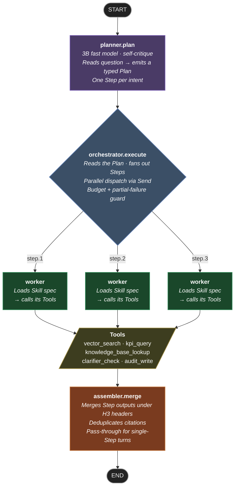
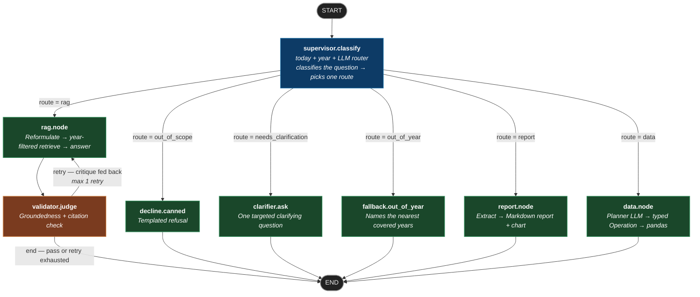

# How the Assistant Works — Graph Reference

Every chat message travels through a pipeline of specialised AI nodes before returning
an answer. This document shows that pipeline as a diagram, explains what each node does
in plain language, and serves as the technical reference for developers extending the graph.

**Source of truth:** [src/agentic_backend/graph/builder.py](../../src/agentic_backend/graph/builder.py) ·
Nodes in [src/agentic_backend/graph/](../../src/agentic_backend/graph/) and [src/agentic_backend/agents/](../../src/agentic_backend/agents/) ·
Edge logic in [src/agentic_backend/graph/edges.py](../../src/agentic_backend/graph/edges.py).

> ✅ **Phase 11 is the active topology** — the Planner · Orchestrator · Workers · Skills
> pipeline runs on every turn. The Phase 1–10 supervisor pipeline is kept below as a
> reference baseline. Full Phase 11 architecture write-up: [docs/architecture/agentic-pipeline.md](agentic-pipeline.md).

---

## 💬 How a message flows (plain English)

1. **Your question arrives** at the FastAPI backend.
2. **The Planner** reads it and writes a short work plan — a list of Steps. One question → one Step. *"What is the refund policy AND the 2024 loss ratio?"* → two parallel Steps.
3. **The Orchestrator** reads the plan and launches each Step. Independent Steps run at the same time.
4. **Workers** execute each Step by loading the right Skill (a specialist sub-agent) and calling its Tools (search the knowledge base, query KPI data, log to audit trail…).
5. **The Assembler** merges all Step results into one clean answer with citations. For a single-Step turn it passes the answer through unchanged.
6. The answer streams back to the React SPA.

---

## Phase 11 — Active pipeline



| Colour | Node | What it does in one line |
|---|---|---|
| 🟣 Purple | **Planner** | Reads the question → writes a typed Plan (DAG of Steps) |
| 🔵 Steel blue | **Orchestrator** | Reads the Plan → fans out Steps in parallel via `Send()` |
| 🟢 Green | **Worker** | Loads one Skill spec → calls its Tools → returns a `StepResult` |
| 🟡 Olive | **Tool** | Atomic function: search, query, or write — one OTel span each |
| 🟠 Orange | **Assembler** | Merges all Step results; self-critiques completeness |
| ⬛ Dark | **Terminal** | START / END — graph entry and exit |

### Phase 11 nodes

| Node | File | LLM calls | Output |
|---|---|---|---|
| `planner.plan` | [agents/planner_agent.py](../../src/agentic_backend/agents/planner_agent.py) | 1 × 3B model + programmatic self-critique | `Plan{plan_id, steps[], rationale}` where each `Step{step_id, skill_name, args, depends_on}` |
| `orchestrator.execute` | [graph/orchestrator.py](../../src/agentic_backend/graph/orchestrator.py) | 0 — pure routing + `Send()` dispatch | Writes `step_results: dict[step_id, StepResult]` via Annotated reducer |
| `worker` | [graph/orchestrator.py](../../src/agentic_backend/graph/orchestrator.py) | Delegated to Skill | `StepResult{step_id, skill_name, answer, citations, status, latency_ms}` |
| `assembler.merge` | [agents/assembler_agent.py](../../src/agentic_backend/agents/assembler_agent.py) | 0 for single Step; 0 for multi (string merge) | `{final_answer, final_citations, route}` |

### Skills and tools

The Planner picks from an auto-discovered **Skill registry** in
[`src/agentic_backend/skills/`](../../src/agentic_backend/skills/). Each Skill lists its `name`, a plain-English
`description`, and the `tools_used` it may call. The Planner sees only the name +
description — never the system prompt.

**Current Skills:** `answer-policy-question` · `clarify-year` · `compute-kpi` ·
`executive-section-summary` · `out-of-year-fallback`.
Skill prompts: [`src/agentic_backend/llm/prompts/skills/`](../../src/agentic_backend/llm/prompts/skills/).

**Available Tools** (auto-discovered from [`src/agentic_backend/tools/`](../../src/agentic_backend/tools/)):
`vector_search` · `kpi_query` · `knowledge_base_lookup` · `clarifier_check` · `audit_write`.

### What happens when something goes wrong

| Situation | What the graph does |
|---|---|
| Planner emits an invalid Plan (cycle, missing Skill) | Self-critique catches it before publishing; if it slips through, the Orchestrator falls back to the legacy supervisor |
| One Step fails mid-run | Orchestrator records the failure, continues with independent Steps, Assembler surfaces a partial answer with a `⚠ partial` badge |
| A Step needs year clarification | Worker calls the `clarify_year` Skill; Orchestrator pauses dependent Steps; next turn resumes from the answer |
| Budget overrun (`max_steps`, `max_tool_calls`, `max_seconds`) | Orchestrator stops early; Assembler emits whatever is ready with a budget-exhausted note |

---

## Phase 1–10 — Legacy pipeline (reference)

This was the active topology through Phase 10. The Supervisor classifies the question and
routes it to exactly one worker node. It remains in the codebase as a fallback path if the
Planner produces an invalid Plan.



| Colour | Node | What it does in one line |
|---|---|---|
| 🔵 Blue | **Supervisor** | Classifies the question and picks exactly one route |
| 🟢 Green | **Worker** | Does the answering work for its specific route |
| 🟠 Orange | **Validator** | Checks the RAG answer for groundedness; may trigger one retry |
| ⬛ Dark | **Terminal** | START / END |

### Phase 1–10 nodes

| Node | File | LLM calls | What it returns |
|---|---|---|---|
| `supervisor.classify` | [graph/supervisor.py](../../src/agentic_backend/graph/supervisor.py) | 0–1 (skipped on year-gap short-circuit) | `{route, today, target_year?, covered_years, fallback_offered?, clarifier_reason?}` |
| `decline.canned` | [graph/supervisor.py](../../src/agentic_backend/graph/supervisor.py) | 0 | `{final_answer, final_citations=[], validated=True}` |
| `clarifier.ask` | [graph/clarifier.py](../../src/agentic_backend/graph/clarifier.py) | 1 | `{final_answer (one clarifying question), final_citations=[]}` |
| `fallback.out_of_year` | [graph/supervisor.py](../../src/agentic_backend/graph/supervisor.py) | 0 | `{final_answer (names nearest covered years), final_citations=[]}` |
| `rag.node` | [agents/rag_agent.py](../../src/agentic_backend/agents/rag_agent.py) | 2 (reformulate + answer) | `{reformulated_query, chunks, draft_answer}` |
| `validator.judge` | [agents/validator_agent.py](../../src/agentic_backend/agents/validator_agent.py) | 1 | `{validation: {grounded, citations_ok, critique}, final_answer?, retry_count?}` |
| `report.node` | [agents/report_agent.py](../../src/agentic_backend/agents/report_agent.py) | 1–3 depending on report type | Without `target_year`: Markdown + chart. With `target_year`: executive Markdown + DOCX/PDF downloadable via `GET /reports/{year}.{ext}` |
| `data.node` | [agents/data_agent.py](../../src/agentic_backend/agents/data_agent.py) | 1 (planner only — executor is pure pandas) | Natural language narrative + Markdown table; typed refusal on invalid queries |

### Phase 1–10 conditional edges

| From | Edge function | Routes to |
|---|---|---|
| `supervisor` | [`route_from_supervisor`](../../src/agentic_backend/graph/edges.py) | `rag` · `report` · `data` · `decline` · `clarifier` · `fallback` |
| `validator` | [`route_from_validator`](../../src/agentic_backend/graph/edges.py) | `retry` → `rag` · `end` (pass or retry budget exhausted) |

`route_from_validator` returns `end` when validation **passes** OR when `retry_count >= 1`
(answer is shown with an `⚠ Unverified` badge in the UI).

---

## Shared `GraphState`

All nodes read from and write to one shared state dictionary, defined in
[src/agentic_backend/graph/state.py](../../src/agentic_backend/graph/state.py):

| Group | Keys |
|---|---|
| Input | `question`, `user_id`, `conversation_id`, `history`, `user_activity` |
| Supervisor | `route`, `today`, `target_year?`, `covered_years`, `fallback_offered?`, `clarifier_reason?`, `audit_trace_id` |
| Planner (Phase 11) | `plan`, `plan_id`, `step_results` |
| RAG node | `reformulated_query`, `chunks`, `draft_answer` |
| Validator | `validation`, `retry_count`, `last_critique` |
| Output | `final_answer`, `final_citations`, `validated` |

`history` and `user_activity` are pre-loaded by
[api/routes/chat.py](../../src/agentic_backend/api/routes/chat.py) before the graph runs (Phase 4 memory).

---

## Streaming

The streaming endpoint (`POST /chat/stream`) uses a manual walker in
[src/agentic_backend/graph/streaming.py](../../src/agentic_backend/graph/streaming.py) instead of the compiled graph.
It calls the same node functions but yields NDJSON stage events between nodes so the
React `PipelineStepper` component updates in real time. The compiled graph is used by `POST /chat`.

---

## Regenerating the diagram

LangGraph can auto-dump the current graph topology as raw Mermaid for a diff check:

```bash
cd poc && source .venv/bin/activate
python -c "from app.graph.builder import get_graph; \
  print(get_graph().get_graph().draw_mermaid())"
```

Compare the output against the diagrams above when you change the graph topology — any
new node or edge from the auto-dump should be reflected here.
